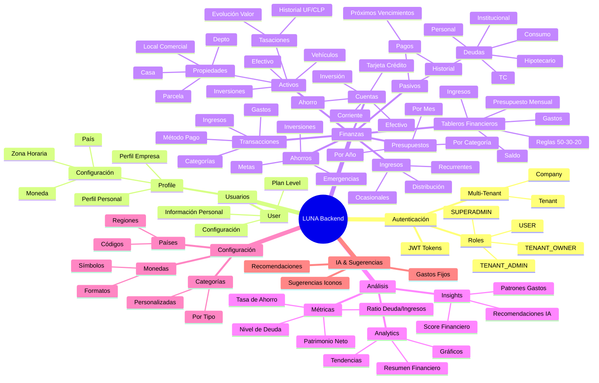
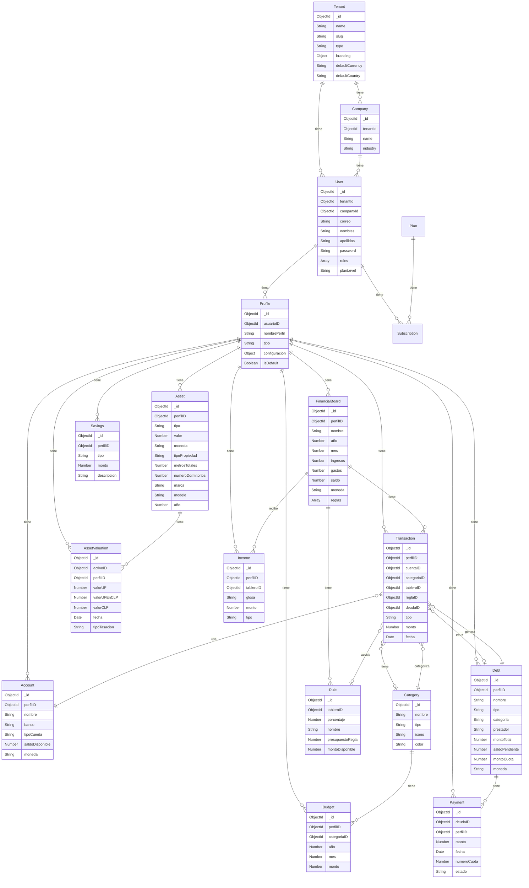

# 🧠 Mapa Mental - LUNA Backend & Base de Datos

## 📊 Vista General de la Arquitectura



---

## 🗄️ Base de Datos - Modelos y Relaciones



---

## 🏗️ Estructura del Backend por Niveles

```mermaid
graph TB
    subgraph "Level 1 - Admin"
        A1[Tenants]
        A2[Overview]
        A3[Metrics]
    end
    
    subgraph "Level 2 - Tenant/Company"
        B1[Companies]
        B2[Dashboard]
    end
    
    subgraph "Level 3 - Usuario Final"
        C1[Auth]
        C2[Profiles]
        C3[Accounts]
        C4[Transactions]
        C5[Debts]
        C6[Payments]
        C7[Assets]
        C8[Asset Valuations]
        C9[Financial Boards]
        C10[Incomes]
        C11[Rules]
        C12[Categories]
        C13[Savings]
        C14[Budgets]
        C15[Analytics]
        C16[App Summary]
        C17[AI Suggestions]
    end
    
    subgraph "Core - Compartido"
        D1[Auth Middleware]
        D2[Error Handler]
        D3[Database]
        D4[Utils]
        D5[AI Service]
    end
    
    A1 --> D1
    A2 --> D1
    B1 --> D1
    B2 --> D1
    C1 --> D1
    C2 --> D1
    C3 --> D1
    C4 --> D1
    C5 --> D1
    C6 --> D1
    C7 --> D1
    C8 --> D1
    C9 --> D1
    C10 --> D1
    C11 --> D1
    C12 --> D1
    C13 --> D1
    C14 --> D1
    C15 --> D1
    C16 --> D1
    C17 --> D5
    
    D1 --> D3
    D2 --> D3
    C15 --> D3
    C16 --> D3
```



---

## 📦 Modelos de Base de Datos - Detalle Completo

### 🔐 Autenticación y Usuarios

#### **User** (Usuario)
- `nombres`, `apellidos`, `correo`, `password`
- `tenantId`, `companyId`, `roles[]`
- `planLevel` (free, premium, pro)
- `isActive`, `isEmailVerified`

#### **Profile** (Perfil Financiero)
- `usuarioID` → User
- `nombrePerfil`, `tipo` (persona, empresa)
- `configuracion` {pais, moneda, zonaHoraria}
- `isDefault`, `isPrincipal`

#### **Role** (Rol)
- `name`, `description`, `permissions`

#### **Tenant** (Inquilino/Marca)
- `name`, `slug`, `type` (own_brand, partner)
- `branding`, `defaultCurrency`, `defaultCountry`

#### **Company** (Empresa)
- `tenantId` → Tenant
- `name`, `industry`, `country`

---

### 💰 Finanzas - Activos

#### **Asset** (Activo)
- `perfilID` → Profile
- `tipo` (Propiedades, Vehículos, Inversiones, Efectivo, Otros)
- `valor`, `moneda`
- **Propiedades:** `tipoPropiedad`, `metrosTotales`, `numeroDormitorios`, `numeroBanos`, `rol`, `direccion`, `comuna`, `avaluoFiscal`, `valorComercial`, `grupoPropiedad`
- **Vehículos:** `marca`, `modelo`, `año`, `kilometraje`, `patente`, `color`

#### **AssetValuation** (Tasación)
- `activoID` → Asset
- `perfilID` → Profile
- `fecha`, `valorUF`, `valorUFEnCLP`, `valorCLP`
- `tipoTasacion` (Compra, Tasación Bancaria, Avalúo Fiscal, etc.)
- `institucion`, `observaciones`

---

### 💳 Finanzas - Pasivos

#### **Debt** (Deuda)
- `perfilID` → Profile
- `nombre`, `tipo` (Personal, Institucional, Bancaria, Comercial)
- `categoria` (TC, LC, Hipotecario, Consumo, Personal, Comercial)
- `prestador`, `montoTotal`, `numeroCuotas`
- `abonoMensual`, `montoCuota` (calculado automáticamente)
- `saldoPendiente`, `saldoPagado`
- `tasaInteres`, `fechaInicio`, `fechaVencimiento`
- `estado` (Activa, Pagada, Vencida)
- `moneda` (CLP, UF, USD, etc.)

#### **Payment** (Pago)
- `deudaID` → Debt
- `perfilID` → Profile
- `monto`, `fecha`, `numeroCuota`
- `estado` (pagado, pendiente, vencido)
- `transaccionID` → Transaction (opcional)

---

### 💵 Finanzas - Movimientos

#### **Account** (Cuenta)
- `perfilID` → Profile
- `nombre`, `banco`, `tipoCuenta` (Corriente, Ahorro, TC, Efectivo, Inversión)
- `saldoDisponible`, `moneda`
- `favorito`

#### **Transaction** (Transacción)
- `perfilID` → Profile
- `cuentaID` → Account
- `categoriaID` → Category
- `tableroID` → FinancialBoard
- `reglaID` → Rule
- `deudaID` → Debt (opcional)
- `tipo` (Ingreso, Gasto)
- `monto`, `fecha`, `detalle`
- `esGastoFijo`

#### **Income** (Ingreso)
- `perfilID` → Profile
- `tableroID` → FinancialBoard (opcional)
- `glosa`, `monto`, `fecha`
- `tipo` (recurrente, ocasional)
- `porcentajeDistribucion`

---

### 📊 Finanzas - Presupuestos

#### **FinancialBoard** (Tablero Financiero)
- `perfilID` → Profile
- `nombre`, `año`, `mes`, `id_mes`
- `ingresos`, `gastos`, `saldo` (calculado automáticamente)
- `moneda`, `porcentajeIngresos`
- `color`, `icono`, `imagen`
- `reglas[]` → Rule

#### **Rule** (Regla de Presupuesto)
- `tableroID` → FinancialBoard
- `porcentaje`, `nombre`
- `color`, `icono`
- `presupuestoRegla` (calculado: ingresos × porcentaje)
- `montoDisponible` (calculado: presupuesto - gastos)
- `saldo`

#### **Category** (Categoría)
- `nombre`, `tipo` (Ingreso, Gasto)
- `icono`, `color`
- `descripcion`

#### **Budget** (Presupuesto)
- `perfilID` → Profile
- `categoriaID` → Category
- `año`, `mes`
- `monto`, `montoGastado`

---

### 💾 Finanzas - Ahorros

#### **Savings** (Ahorro)
- `perfilID` → Profile
- `tipo` (Ahorro, Inversión, Emergencia, Meta)
- `monto`, `descripcion`
- `fechaObjetivo` (opcional)

---

### 📈 Análisis y Métricas

#### **MetricsSnapshot** (Métrica)
- `scope` (tenant, company, user)
- `targetId`, `period`
- `metrics` (JSON con KPIs)

---

### ⚙️ Configuración

#### **Country** (País)
- `codigo`, `nombre`, `region`
- `isActive`

#### **Currency** (Moneda)
- `codigo`, `nombre`, `simbolo`
- `formato`, `isActive`

#### **Plan** (Plan)
- `name`, `description`
- `priceMonthly`, `priceYearly`
- `features`, `maxAccounts`, `maxProfiles`

#### **Subscription** (Suscripción)
- `targetId` (userId o tenantId)
- `planId` → Plan
- `status`, `startedAt`, `expiresAt`

#### **Configuration** (Configuración Global)
- Configuraciones generales del sistema

---

## 🔗 Relaciones Principales

### Flujo de Datos:

```
User (Usuario)
  └── Profile (Perfil Financiero)
      ├── Account (Cuentas)
      ├── Transaction (Transacciones)
      │   ├── Account (de dónde sale/va)
      ├── Category (categoría)
      ├── FinancialBoard (tablero)
      │   └── Rule (reglas 50-30-20)
      ├── Income (ingresos)
      │   └── FinancialBoard (asociado)
      ├── Debt (deudas)
      │   └── Payment (pagos)
      │       └── Transaction (opcional)
      ├── Asset (activos)
      │   └── AssetValuation (tasaciones)
      ├── Savings (ahorros)
      └── Budget (presupuestos)
          └── Category (categoría)
```

---

## 🎯 Endpoints por Módulo

### 🔐 Autenticación
- `POST /api/v1/auth/register` - Registro
- `POST /api/v1/auth/login` - Login
- `GET /api/v1/auth/me` - Usuario actual

### 👤 Perfiles
- `GET /api/v1/profiles` - Listar
- `POST /api/v1/profiles` - Crear
- `GET /api/v1/profiles/:id` - Obtener
- `PUT /api/v1/profiles/:id` - Actualizar
- `DELETE /api/v1/profiles/:id` - Eliminar

### 💳 Cuentas
- `GET /api/v1/accounts?perfilID=xxx` - Listar
- `POST /api/v1/accounts` - Crear
- `GET /api/v1/accounts/:id` - Obtener
- `PUT /api/v1/accounts/:id` - Actualizar
- `DELETE /api/v1/accounts/:id` - Eliminar

### 💵 Transacciones
- `GET /api/v1/transactions?perfilID=xxx` - Listar
- `POST /api/v1/transactions` - Crear
- `GET /api/v1/transactions/:id` - Obtener
- `PUT /api/v1/transactions/:id` - Actualizar
- `DELETE /api/v1/transactions/:id` - Eliminar

### 💰 Deudas
- `GET /api/v1/debts?perfilID=xxx` - Listar
- `GET /api/v1/debts/level?perfilID=xxx` - **Nivel de Deuda**
- `GET /api/v1/debts/summary?perfilID=xxx` - Resumen
- `POST /api/v1/debts` - Crear
- `GET /api/v1/debts/:id` - Obtener
- `PUT /api/v1/debts/:id` - Actualizar
- `DELETE /api/v1/debts/:id` - Eliminar
- `POST /api/v1/debts/:id/pay` - Pagar

### 💸 Pagos
- `GET /api/v1/payments?perfilID=xxx&deudaID=xxx` - Listar
- `POST /api/v1/payments` - Crear
- `GET /api/v1/payments/:id` - Obtener
- `PUT /api/v1/payments/:id` - Actualizar
- `DELETE /api/v1/payments/:id` - Eliminar

### 🏠 Activos
- `GET /api/v1/assets?perfilID=xxx&tipo=Propiedades` - Listar
- `POST /api/v1/assets` - Crear
- `GET /api/v1/assets/:id` - Obtener
- `PUT /api/v1/assets/:id` - Actualizar
- `DELETE /api/v1/assets/:id` - Eliminar

### 📈 Tasaciones
- `GET /api/v1/assets/:assetId/valuations` - Listar
- `GET /api/v1/assets/:assetId/valuations/history` - **Historial con Evolución**
- `POST /api/v1/assets/:assetId/valuations` - Crear
- `GET /api/v1/assets/valuations/:id` - Obtener
- `PUT /api/v1/assets/valuations/:id` - Actualizar
- `DELETE /api/v1/assets/valuations/:id` - Eliminar

### 📊 Tableros Financieros
- `GET /api/v1/financial-boards?perfilID=xxx&año=2025&mes=12` - Listar
- `POST /api/v1/financial-boards` - Crear (crea reglas 50-30-20 automáticamente)
- `GET /api/v1/financial-boards/:id` - Obtener (con ingresos y gastos)
- `PUT /api/v1/financial-boards/:id` - Actualizar
- `DELETE /api/v1/financial-boards/:id` - Eliminar

### 💰 Ingresos
- `GET /api/v1/incomes?perfilID=xxx&tableroID=xxx` - Listar
- `POST /api/v1/incomes` - Crear
- `GET /api/v1/incomes/:id` - Obtener
- `PUT /api/v1/incomes/:id` - Actualizar
- `DELETE /api/v1/incomes/:id` - Eliminar

### 📐 Reglas
- `GET /api/v1/rules?tableroID=xxx` - Listar
- `POST /api/v1/rules` - Crear (máximo 4 por tablero)
- `GET /api/v1/rules/:id` - Obtener
- `PUT /api/v1/rules/:id` - Actualizar
- `DELETE /api/v1/rules/:id` - Eliminar (mínimo 2 por tablero)

### 📁 Categorías
- `GET /api/v1/categories?tipo=Gasto` - Listar
- `POST /api/v1/categories` - Crear
- `GET /api/v1/categories/:id` - Obtener
- `PUT /api/v1/categories/:id` - Actualizar
- `DELETE /api/v1/categories/:id` - Eliminar

### 🐷 Ahorros
- `GET /api/v1/savings?perfilID=xxx` - Listar
- `POST /api/v1/savings` - Crear
- `GET /api/v1/savings/:id` - Obtener
- `PUT /api/v1/savings/:id` - Actualizar
- `DELETE /api/v1/savings/:id` - Eliminar

### 📋 Presupuestos
- `GET /api/v1/budgets?perfilID=xxx` - Listar
- `POST /api/v1/budgets` - Crear
- `GET /api/v1/budgets/:id` - Obtener
- `PUT /api/v1/budgets/:id` - Actualizar
- `DELETE /api/v1/budgets/:id` - Eliminar

### 📊 Analytics
- `GET /api/v1/analytics/summary?perfilID=xxx` - Resumen
- `GET /api/v1/analytics/trends?perfilID=xxx` - Tendencias

### 📱 App
- `GET /api/v1/app/summary` - Resumen completo
- `GET /api/v1/app/net-worth?profileId=xxx` - **Patrimonio Neto**
- `GET /api/v1/app/financial-score?profileId=xxx` - **Score Financiero**
- `GET /api/v1/app/insights` - Insights con IA

### 🤖 IA
- `GET /api/v1/ai/suggest-board-icon?nombre=Casa` - Sugerir icono
- `GET /api/v1/ai/suggest-fixed-expenses?perfilID=xxx&tableroID=xxx` - Sugerir gastos fijos

### 🌍 Públicos
- `GET /api/v1/countries` - Países
- `GET /api/v1/countries/:codigo` - País específico
- `GET /api/v1/currencies` - Monedas
- `GET /api/v1/currencies/:codigo` - Moneda específica

---

## 🎨 Características Especiales

### ✨ Cálculos Automáticos

1. **Patrimonio Neto**
   ```
   Patrimonio = Activos + Cuentas + Ahorros - Deudas
   ```

2. **Score Financiero (0-100)**
   - Tasa de ahorro (0-25 puntos)
   - Ratio deuda/ingresos (0-25 puntos)
   - Diversidad de cuentas (0-15 puntos)
   - Consistencia transacciones (0-15 puntos)
   - Base de activos (0-10 puntos)
   - Adherencia presupuesto (0-10 puntos)

3. **Nivel de Deuda (1-4)**
   - Nivel 1: 🟢 Saludable (todas al día, ratio < 30%)
   - Nivel 2: 🟡 Controlada (atrasos 30-59 días, ratio 30-50%)
   - Nivel 3: 🟠 En Riesgo (atrasos 60-89 días, ratio 50-70%)
   - Nivel 4: 🔴 Crítica (atrasos 90+ días, ratio > 70%)

4. **Evolución de Tasaciones**
   - Calcula cambio en UF y CLP
   - Muestra tendencia (up/down/stable)
   - Resumen de apreciación/depreciación

5. **Reglas de Presupuesto**
   - Calcula `presupuestoRegla` = (ingresos × porcentaje) / 100
   - Calcula `montoDisponible` = presupuesto - gastos
   - Actualiza automáticamente

---

## 📊 Estadísticas del Sistema

- **23 Modelos** de base de datos
- **19 Módulos** de endpoints (Level 3)
- **3 Niveles** de acceso (Admin, Tenant, User)
- **Multi-tenant** completo
- **Multi-moneda** (CLP, UF, USD, COP, EUR)
- **Multi-perfil** (persona, empresa)

---

## 🔄 Flujos Principales

### Flujo: Registrar Gasto con Deuda
```
1. POST /api/v1/transactions
   {
     "tipo": "Gasto",
     "monto": 50000,
     "deudaID": "xxx",
     "tableroID": "yyy"
   }
   
2. Sistema automáticamente:
   - Crea Payment asociado
   - Actualiza saldoPendiente de Debt
   - Actualiza gastos del FinancialBoard
   - Actualiza montoDisponible de Rule
```

### Flujo: Crear Tablero Financiero
```
1. POST /api/v1/financial-boards
   {
     "nombre": "Depto",
     "año": 2025,
     "mes": 12
   }
   
2. Sistema automáticamente:
   - Crea 3 reglas por defecto (50-30-20)
   - Copia gastos fijos del mes anterior
   - Calcula saldo inicial
```

### Flujo: Registrar Tasación
```
1. POST /api/v1/assets/:assetId/valuations
   {
     "valorUF": 5200,
     "valorUFEnCLP": 37000,
     "fecha": "2022-06-01"
   }
   
2. Sistema automáticamente:
   - Calcula valorCLP = 5200 × 37000
   - Compara con tasación anterior
   - Muestra cambio y tendencia
```

---

## 🎯 Próximas Funcionalidades (Roadmap)

- [ ] Integración bancaria automática (Plaid, Belvo)
- [ ] OCR para recibos y facturas
- [ ] Reconocimiento de voz
- [ ] Exportación de reportes (PDF, Excel)
- [ ] Notificaciones push
- [ ] Recordatorios de pagos
- [ ] Consolidación de deudas
- [ ] Simulador de créditos
- [ ] Comparador de productos financieros

---

**Última actualización:** Diciembre 2025
